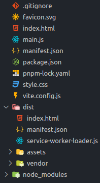

# Get Started with no framework

Sometimes you don't want to use a framework for your Chrome Extension, or you
want to add a framework later. I have news for you! Vite and CRXJS don't require
you to choose a JS framework to get started. Don't worry. Vite still provides
HMR for CSS, and your JavaScript changes will trigger a full page reload.

## Create your project

Use your favorite package manager to scaffold a new project and follow the
prompts to create a vanilla JS project.

```sh
npm init vite@latest
```

## Install CRXJS Vite plugin

Now install the CRXJS Vite plugin using your favorite package manager.

```sh
npm i @crxjs/vite-plugin -D
```

## Create a Vite config file

Create `vite.config.js` with the code below.

```js title=vite.config.js
import { defineConfig } from 'vite'
import { crx } from '@crxjs/vite-plugin'
import manifest from './manifest.json'

export default defineConfig({
  plugins: [crx({ manifest })],
})
```

Create a file named `manifest.json` next to `vite.config.js`.

```json title=manifest.json
{
  "manifest_version": 3,
  "name": "CRXJS Vanilla JS Example",
  "version": "1.0.0",
  "action": { "default_popup": "index.html" }
}
```

And run the dev command in the terminal.

```sh
npm run dev
```

That's it! CRXJS will do the rest. Your project directory should look like this:



## Add the extension to Chrome

Let's try it out.

When the build completes, open Chrome or Edge and navigate to
`chrome://extensions`. Make sure to turn on the developer mode switch.

| Chrome                                                                | Edge                                                              |
| --------------------------------------------------------------------- | ----------------------------------------------------------------- |
| Top right corner                                                      | Middle left sidebar                                               |
|  |  |

Drag your `dist` folder into the Extensions Dashboard to install it. Your
extension icon will be in the top bar. The icon will be the first letter of the
extension's name.


## Profit with Vite HMR

Once you've found the extension icon, right-click it and choose "Inspect popup
window". This menu item will open the popup and the popup dev tools window. We
need to inspect the popup to keep it open while making changes.


Let's see how Vite handles file updates without an HMR framework. We can add a
counter button to test if Vite preserves the page state.

```javascript title=main.js
import './style.css'

document.querySelector('#app').innerHTML = `
  <h1>Hello Vite!</h1>
  <a href="https://vitejs.dev/guide/features.html" target="_blank">Documentation</a>
  // highlight-next-line
  <button>Count: 0</button>
`

// highlight-start
let count = 0
const button = document.querySelector('#app button')
button.addEventListener('click', () => {
  count++
  button.textContent = `Count: ${count}`
})
// highlight-end
```

Vite will trigger a full page reload when we save our file. The popup will stay
open since the devtools inspector is open. Our button is there, but the elements
look a little squashed.


HTML and JS changes trigger full page reloads, but Vite provides HMR updates for
imported styles _without_ a full page reload. Click that counter a few times and
then update `styles.css` to fix the page layout.

```css title=styles.css
#app {
  font-family: Avenir, Helvetica, Arial, sans-serif;
  text-align: center;
  color: #2c3e50;
  // highlight-next-line
  margin-top: 60px; /* Remove this line */

  // highlight-start
  width: 100px;
  display: flex;
  flex-direction: column;
  justify-content: center;
  align-items: center;
  row-gap: 5px;
  // highlight-end
}
```

Vite will update the styles while preserving the counter state. Pretty good for
a vanilla JavaScript project!


